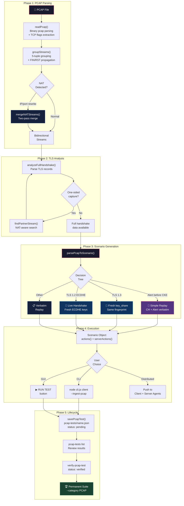
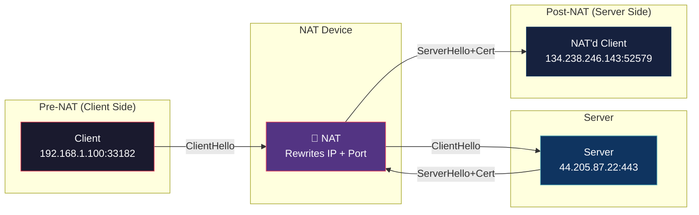
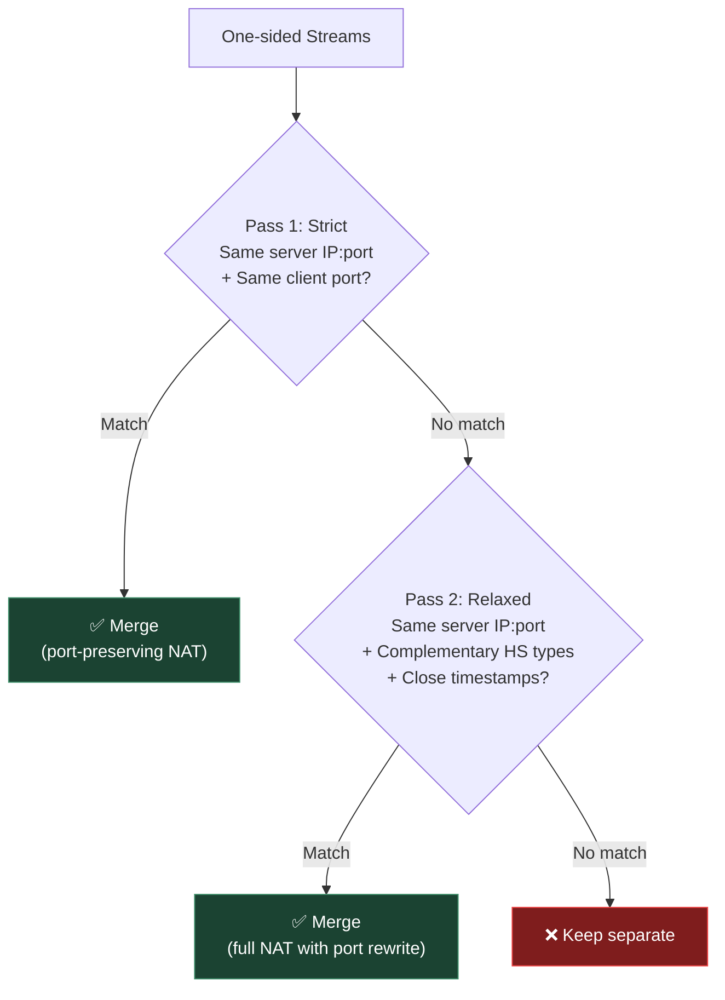
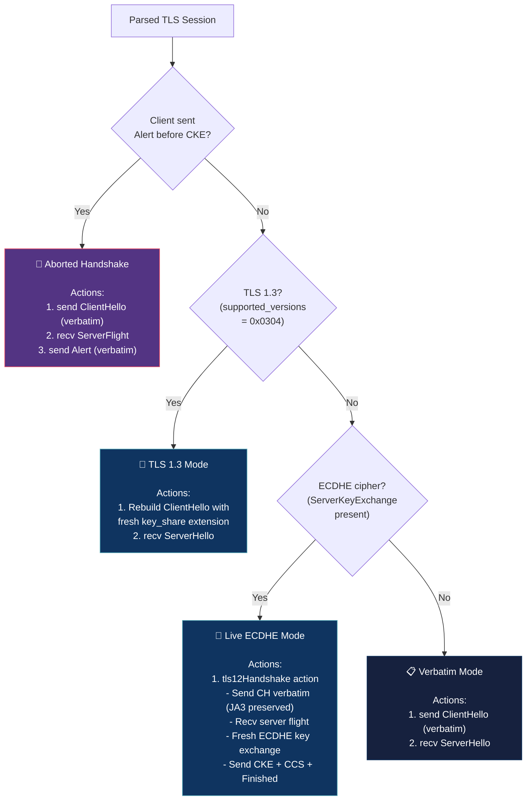
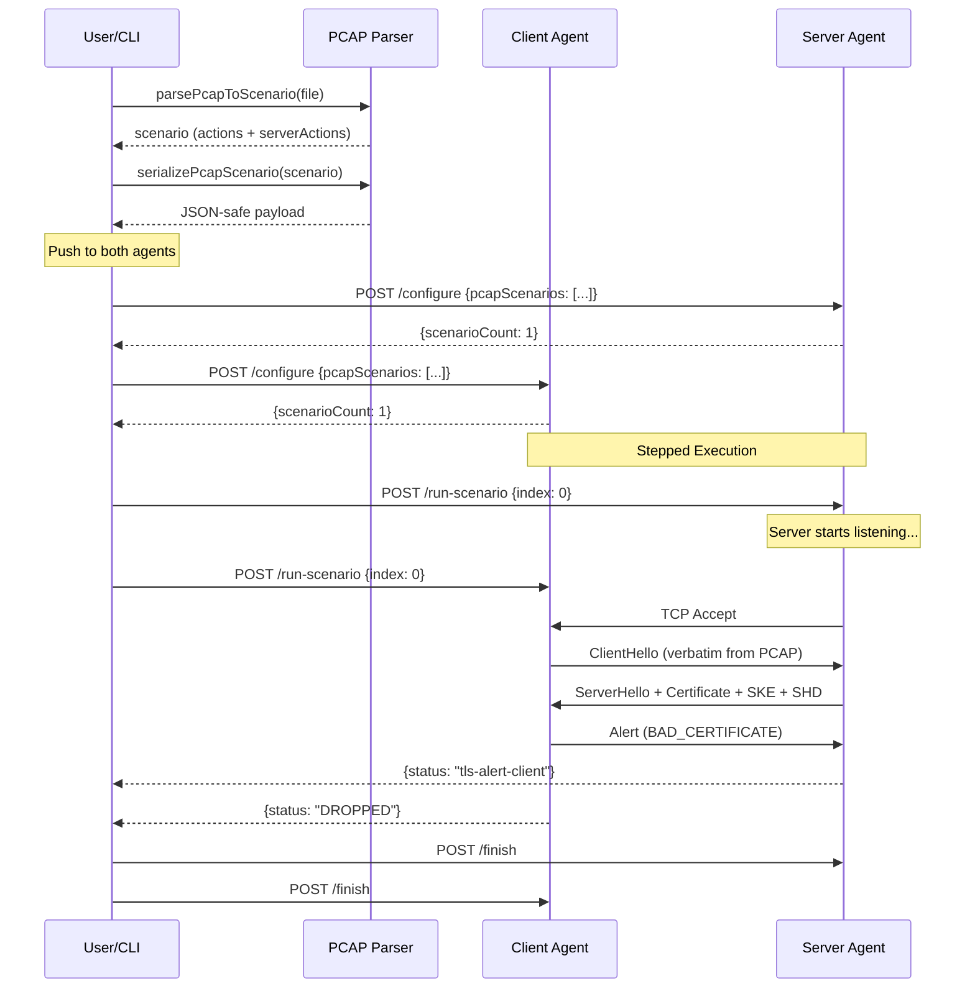
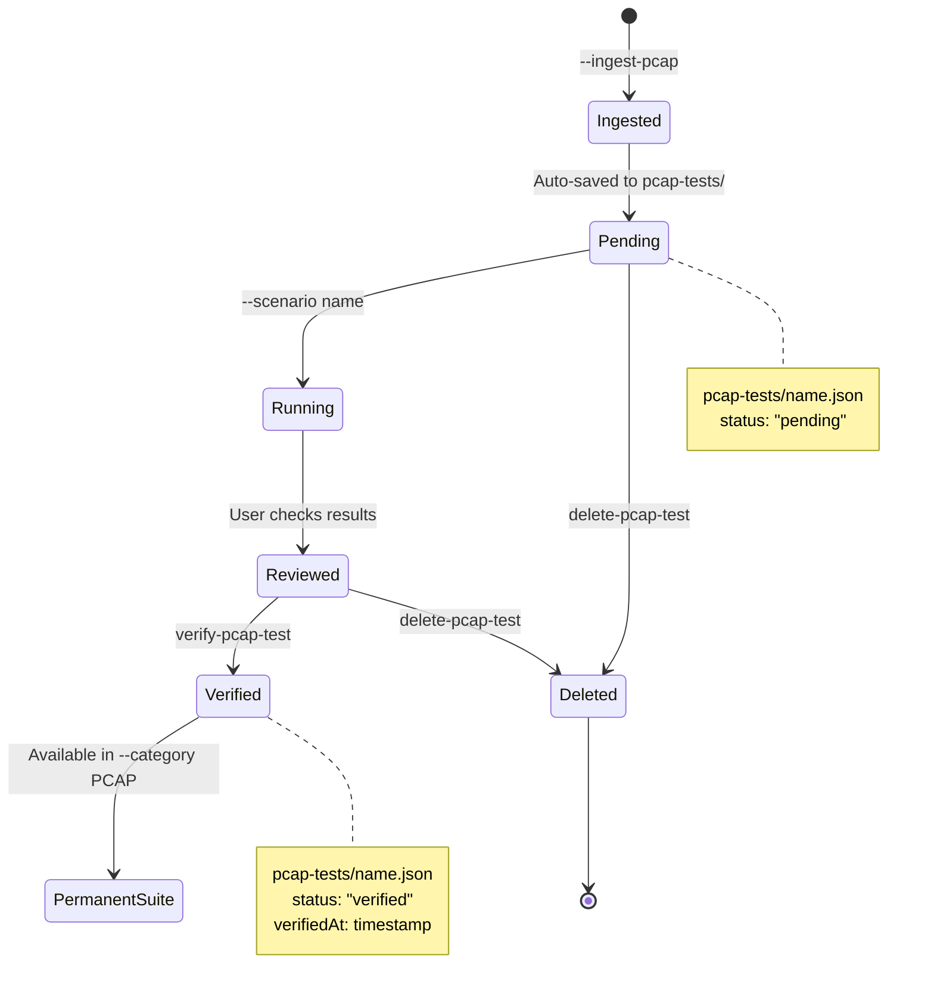

# PCAP Ingestion — Test Case Generation & Scenario Management

## Overview

The PCAP ingestion feature allows the fuzzer to **recreate TLS sessions from captured network traffic**. It parses a PCAP file, extracts TLS handshake parameters, and generates a test scenario that replays the exact same client/server behavior — including handling PFS (Perfect Forward Secrecy) ciphers by performing live key exchange at runtime.

**No external services or AI required** — the entire pipeline runs locally using deterministic binary parsing.

---

## Architecture Flow



---

## NAT Detection & Stream Merging

When a NAT device sits between the capture point and the endpoints, client and server traffic appears as **separate one-sided streams** with different IPs (and sometimes different ports).



### What the PCAP capture sees:

| Stream | Direction | Packets | Content |
|--------|-----------|---------|---------|
| Stream A | `192.168.1.100:33182 → 44.205.87.22:443` | 3 (c2s only) | ClientHello + Alert |
| Stream B | `44.205.87.22:443 → 134.238.246.143:52579` | 6 (c2s only) | ServerHello + Cert + SKE + SHD |

### Merge Strategy (Two-Pass):



---

## TLS Handshake Decision Tree



---

## Distributed Mode Flow



---

## Test Lifecycle



---

## CLI Commands

### Ingest a PCAP and create a test

```bash
# List streams in a PCAP
node cli.js client host 443 --ingest-pcap capture.pcap --list-streams

# Ingest stream 0 (auto-saves to pcap-tests/)
node cli.js client host 443 --ingest-pcap capture.pcap

# Ingest with custom name
node cli.js client host 443 --ingest-pcap capture.pcap --pcap-name my-tls-test

# Ingest without saving (run only)
node cli.js client host 443 --ingest-pcap capture.pcap --no-save

# Ingest and run in distributed mode
node cli.js client host 443 --ingest-pcap capture.pcap --distributed
```

### Manage saved tests

```bash
# List all saved PCAP tests
node cli.js pcap-tests

# Run a saved test
node cli.js client host 443 --scenario pcap-tls-session-0

# Run all PCAP tests
node cli.js client host 443 --category PCAP

# Verify a test (promote to permanent suite)
node cli.js verify-pcap-test pcap-tls-session-0

# Delete a test
node cli.js delete-pcap-test pcap-tls-session-0
```

### Distributed mode

```bash
# Using the standalone orchestrator
node test-pcap-distributed.js capture.pcap \
  --client-host localhost --client-port 9200 \
  --server-host localhost --server-port 9201

# Using the CLI
node cli.js client host 443 --ingest-pcap capture.pcap --distributed \
  --client-agent localhost:9200 --server-agent localhost:9201
```

---

## File Structure

```
fuzzer/
├── lib/
│   ├── pcap-parser.js        # PCAP reading, stream grouping, NAT merge,
│   │                         # TLS analysis, scenario generation,
│   │                         # serialization/deserialization
│   ├── pcap-scenarios.js     # Test lifecycle: save/load/list/verify/delete
│   ├── scenarios.js          # PCAP category registration, getScenario() integration
│   ├── agent.js              # /configure accepts pcapScenarios for distributed mode
│   ├── unified-client.js     # tls12Handshake handler, Buffer coercion
│   ├── tls-validate.js       # TLS message parsing (CH, SH, Cert, etc.)
│   ├── tls12-crypto.js       # ECDHE key exchange, completeHandshake()
│   ├── record.js             # TLS record layer parsing
│   ├── handshake.js          # TLS message building (buildClientHello, etc.)
│   └── constants.js          # TLS constants (types, versions, ciphers)
├── pcap-tests/               # Saved PCAP test files (JSON)
│   └── .gitkeep
├── test-pcap-distributed.js  # Standalone distributed PCAP test orchestrator
├── cli.js                    # CLI with --ingest-pcap, pcap-tests, verify commands
├── main.js                   # Electron main (Edit menu, save-pcap-test IPC)
├── preload.js                # Electron IPC bridge (savePcapTest)
└── renderer/
    ├── app.js                # GUI: RUN TEST + Save to Suite checkbox,
    │                         # certificate key type/size display
    └── index.html            # Dialog layout
```

---

## Saved Test File Format

```json
{
  "meta": {
    "status": "pending",
    "createdAt": "2026-04-07T17:10:38.601Z",
    "verifiedAt": null,
    "sourceFile": "/path/to/capture.pcap",
    "streamIndex": 0,
    "description": "Live TLS session recreated from PCAP. (NAT-merged)",
    "explanation": "TLS Session Recreation. NAT detected..."
  },
  "scenario": {
    "name": "pcap-tls-session-0",
    "category": "Z",
    "description": "...",
    "side": "client",
    "protocol": "tls",
    "clientActions": [
      {
        "type": "send",
        "data": { "_hex": "16030105da01..." },
        "label": "ClientHello (verbatim replay)"
      },
      {
        "type": "recv",
        "timeout": 5000,
        "label": "Wait for Server Handshake"
      },
      {
        "type": "send",
        "data": { "_hex": "150303000202" },
        "label": "Post-handshake Alert (7B)"
      }
    ],
    "serverActions": [
      {
        "type": "send",
        "data": { "_hex": "160303..." },
        "label": "Generated ServerHello (mirrored from PCAP)"
      },
      {
        "type": "send",
        "data": { "_hex": "160303..." },
        "label": "Certificate (from PCAP)"
      },
      {
        "type": "recv",
        "timeout": 5000,
        "label": "Wait for client response"
      }
    ],
    "_serializedPcap": true
  }
}
```

---

## Certificate Key Type Detection

The handshake analysis extracts public key algorithm and size from DER-encoded X.509 certificates:

| Algorithm | OID | Key Sizes |
|-----------|-----|-----------|
| RSA | `1.2.840.113549.1.1.1` | 1024, 2048, 3072, 4096, 8192 |
| EC (ECDSA) | `1.2.840.10045.2.1` | P-256 (256), P-384 (384), P-521 (521) |
| Ed25519 | `1.3.101.112` | 256 |

Display format in GUI and CLI:
```
[1] CN=registration-agent-ica-useast1 (2133 bytes) | RSA-4096
[2] CN=RegistrationAgentRoot (987 bytes) | EC-256 (P-256)
```
